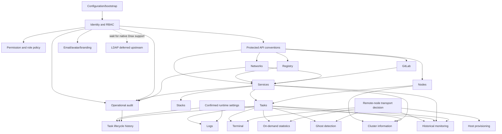

# Domain dependency graph

## Graph

## Dependency rules

1. **Bootstrap and identity precede feature expansion.** Current environment-name mismatch, unsafe root seed, and incomplete Admin permissions can invalidate every authorization test.
2. **Permission policy precedes UI actions.** Existing backend permission constants are evidence; legacy unguarded REST/WebSocket paths are defects, not contracts.
3. **Services, Tasks and Nodes are foundations.** Stacks is already a derived Services view. Logs, terminal, statistics and cluster views depend on stable task/node identity.
4. **Remote-node topology is one shared decision.** Terminal, stats, ghosts, all-node provisioning and monitoring must not each invent a transport.
5. **Audit precedes newly exposed destructive operations.** Service mutations now have durable history; network replacement still does not.
6. **Monitoring comes after on-demand stats and topology proof.** It additionally requires persistence, worker ownership, retention and task-replacement semantics.
7. **Settings are not foundational as a generic platform.** Introduce only values required by an accepted domain.
8. **GitLab and Registry are already independent read-only integrations.** Their only unresolved dependency is whether deployment workflows consume them and which permissions govern them.

## Cycles and coupling to avoid

- Legacy task lifecycle history heuristically joins audit records in the browser. Replace with an explicit event/audit relation only if lifecycle history survives.
- Legacy monitoring owns overlapping service/task/container snapshots. Define normalized operational DTOs before persistence; do not persist raw legacy graph shapes unchanged.
- Do not make Stacks a persisted entity: it is a label-derived view.
- Do not make every Docker resource a generic Drax CRUD entity: Docker is the source of truth and many operations are commands, streams or derived snapshots.

## Critical path

`bootstrap/auth correctness → permission/role parity → protected operations → durable mutation audit → deploy shared agent on debianvm → remote-node API/browser proof → monitoring deployment proof`

The shared-agent deployment and task proof on `debianvm` closed NODE-03, GHOST-03, TERM-02, STAT-01, STAT-02 and AGENT-01 without adding a transport. The next selected implementation slice is RBAC-03 users/roles administration, starting with the ID-05 shared-Mongo existing-user login proof. LDAP remains deferred until Drax implements it.
